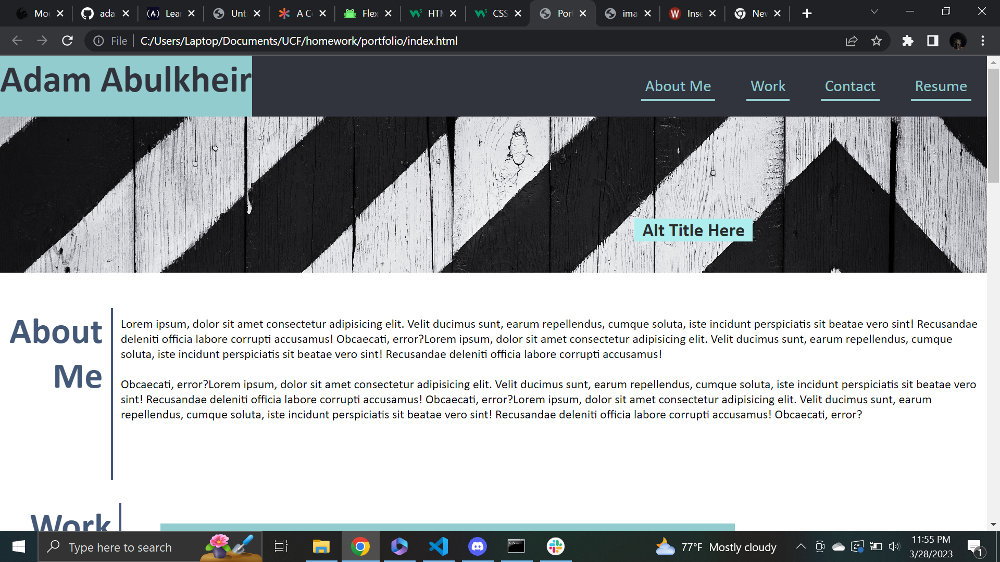

# Portfolio

## This is the second challenge in my boot camp
-I was not provided any code by the camp to start on this assignment.
-through my own research and help from my peers, I created an index.html and style.css to create a portfolio website that I will continue to tweak and add content to reflecting upon my future progress in this course.
-used advanced css tools to create flexboxes to style webpage futher

## Installation
-none, visit: https://adamabulkheir.github.io/portfolio/

##
'''md
'''

## credits
-assisted by a conglomerate effort of my peers

## License
-MIT